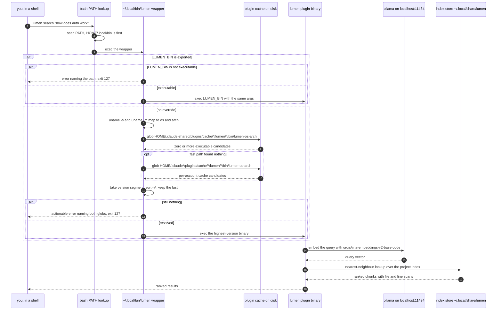
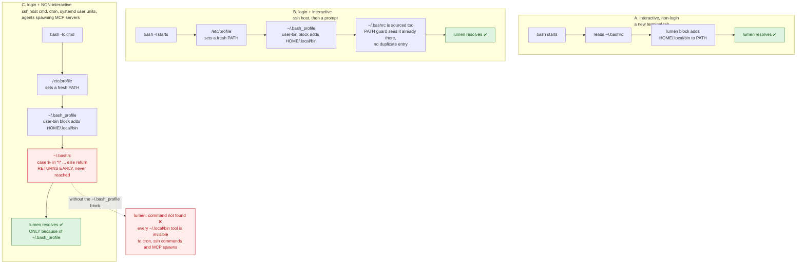
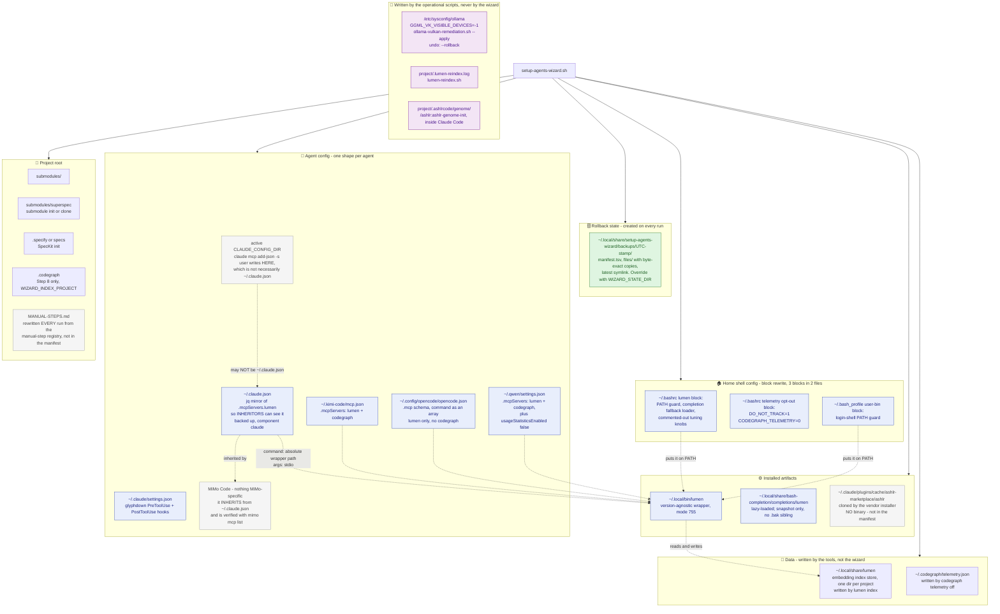
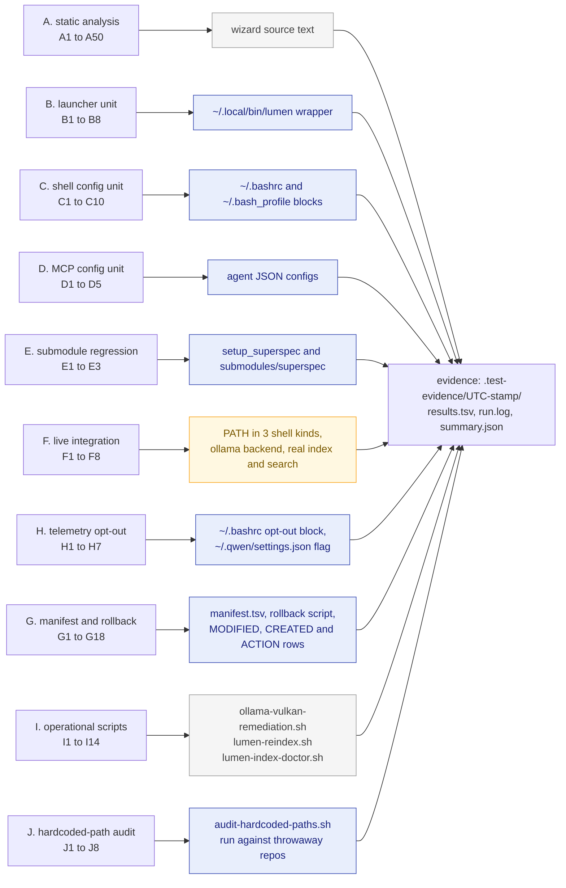
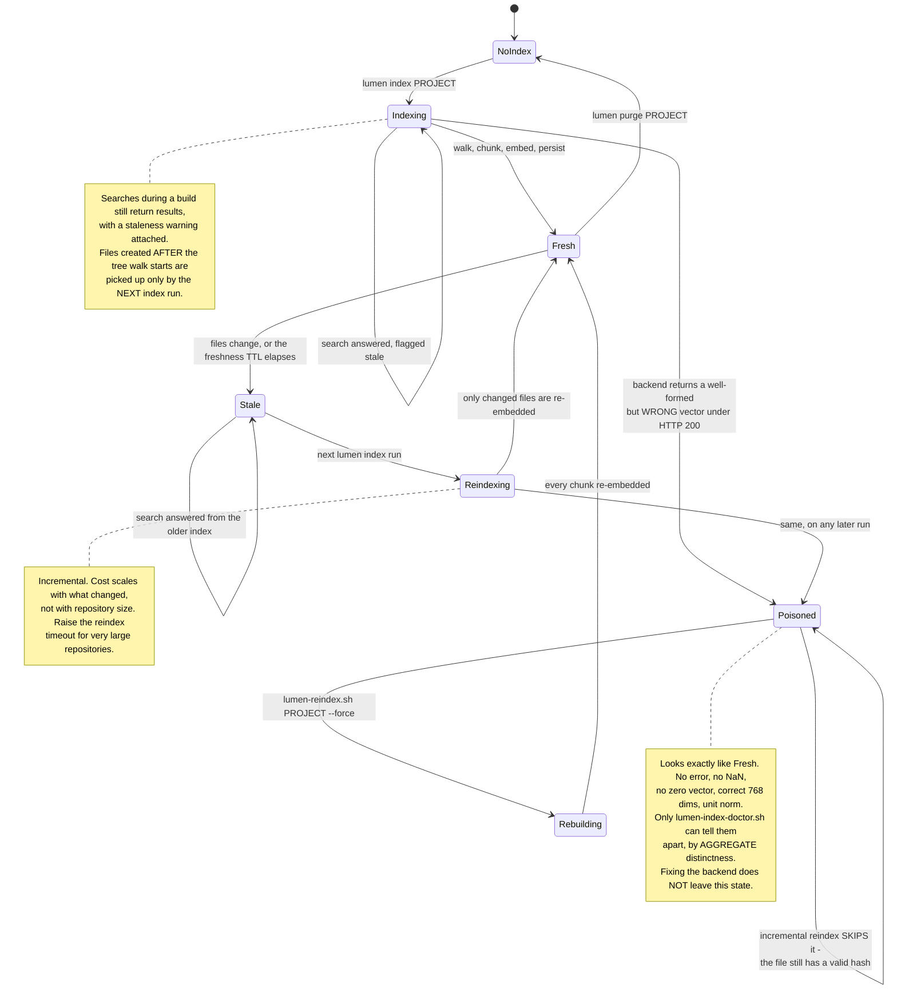

# 🏗️ Setup Wizard Architecture

Visual reference for `scripts/setup-agents-wizard.sh` and its test-suite
`scripts/test-setup-agents-wizard.sh`.

Where the [README](./README.md) tells you **what to run**, this document shows **how the
pieces fit together**: the order of the nine steps, how `lumen` is actually resolved at call
time, why two shell init files are written instead of one, everything the wizard touches on
disk, what the test groups cover, and how the semantic index moves between states.

Every diagram below is derived from the current code. Six facts are worth stating up front
because they are easy to get wrong:

- **Lumen is not an npm package.** It ships as a Claude Code **plugin binary** at
  `~/.claude-shared/plugins/cache/<marketplace>/lumen/<version>/bin/lumen-<os>-<arch>`.
  The wizard installs a version-agnostic wrapper on `PATH` instead of a pinned symlink.
- **Lumen's MCP subcommand is `stdio`**, not `serve`. `serve` does not exist and fails with
  `Error: unknown command "serve" for "lumen"`.
- **Kimi, Opencode and MiMo Code are detected, never installed.** They are not on npm under
  those names, so the wizard prints the vendor URL instead. The only agent CLI it installs is
  Qwen Code, from `@qwen-code/qwen-code` — whose binary is `qwen`, not `qwen-code`.
- **Each agent gets a different MCP shape**, at a different path. There is no single
  config file the wizard writes for all five — but there *is* one file several of them
  **inherit** from, `~/.claude.json`, which is why the wizard mirrors Lumen into it rather than
  trusting `claude mcp add-json -s user` to have landed there.
- **ashlr is a Claude Code plugin with no binary.** `command -v ashlr` never succeeds, by
  design; the wizard verifies its plugin directory instead. Turning the clone into a working
  plugin takes slash commands only a human can run.
- **The wizard ends by listing what it could NOT do.** The `ACTION REQUIRED` section, the
  `MANUAL-STEPS.md` file and the Enter pause are a first-class part of the flow, not an
  epilogue — see §1.

---

## 1. 🔁 End-to-end wizard flow

The wizard runs seven numbered steps top to bottom, non-interactively; the seventh is opt-in
and only runs with `WIZARD_INDEX_PROJECT` set. Only **Step 1** can abort
the run: missing `git`/`curl`/`node`/`npm`, or a `jq` install that cannot be completed, exits
with status 1. Everything after that is *best-effort* — a failed npm package, a missing Ollama
daemon or a failed model pull produces a warning and the wizard keeps going, which is why the
final summary is the authoritative report rather than the exit code.

```mermaid
flowchart TD
    START["run scripts/setup-agents-wizard.sh"] --> LIB{"SETUP_WIZARD_LIB_ONLY set?"}
    LIB -- yes --> RET["return 0<br/>library mode: definitions only,<br/>used by the test suite"]
    LIB -- no --> DET["detect SCRIPT_DIR<br/>PROJECT_ROOT is its parent"]
    DET --> BK["backup_init<br/>open the rollback session<br/>before anything is touched"]
    BK --> P1

    P1["Step 1 - prerequisites<br/>git, curl, node, npm"] --> P1Q{"all four present?"}
    P1Q -- no --> P1X["print_error<br/>exit 1"]
    P1Q -- yes --> JQ{"jq on PATH?"}
    JQ -- no --> JQI["ensure_jq<br/>apt-get, else yum, else brew<br/>else exit 1"]
    JQI --> JQ2{"jq present now?"}
    JQ2 -- no --> JQX["print_error<br/>exit 1"]
    JQ2 -- yes --> G1
    JQ -- yes --> G1

    G1["Step 2 - global CLI tools"] --> BUN{"bun on PATH?"}
    BUN -- no --> BUNI["curl bun.sh installer<br/>prepend HOME/.bun/bin"]
    BUN -- yes --> NPM
    BUNI --> NPM
    NPM["npm_install_if_missing codegraph @colbymchenry/codegraph<br/>npm_install_if_missing glyphdown glyphdown<br/>installs only what is MISSING,<br/>records an undo ACTION for each<br/>Lumen deliberately NOT from npm"] --> SPK
    SPK{"specify on PATH?"}
    SPK -- yes --> AGT
    SPK -- no --> UVQ{"uv available?"}
    UVQ -- yes --> SPKI["uv tool install specify-cli<br/>a Python tool, not an npm package<br/>record_action speckit uv tool uninstall specify-cli"]
    UVQ -- no --> SPKW["warn: install uv first"]
    SPKI --> AGT
    SPKW --> AGT
    AGT["npm_install_if_missing qwen @qwen-code/qwen-code<br/>package name is @qwen-code/qwen-code,<br/>the BINARY it provides is qwen"] --> ROLL
    ROLL["roll call, detection only:<br/>kimi, opencode, mimo<br/>print the vendor URL when missing<br/>never npm-installed - those names<br/>are 404s or unrelated packages"] --> ASH
    ASH{"ashlr plugin dir<br/>already present?"}
    ASH -- yes --> ASHOK["nothing to install"]
    ASH -- no --> ASHB{"bun available?"}
    ASHB -- yes --> ASHI["curl plugin.ashlr.ai/install.sh<br/>clones into ~/.claude/plugins/cache/<br/>ashlr-marketplace/ashlr<br/>NO binary is created - by design"]
    ASHB -- no --> ASHS["warn, skip ashlr"]
    ASHOK --> WOZ
    ASHI --> WOZ
    ASHS --> WOZ
    WOZ{"wozcode present?"}
    WOZ -- yes --> L1
    WOZ -- no --> WOZE{"WOZCODE_INSTALL_CMD set?"}
    WOZE -- yes --> WOZI["eval the provided install command"]
    WOZE -- no --> WOZW["warn, skipped"]
    WOZI --> L1
    WOZW --> L1

    L1["Step 3 - ensure_lumen"] --> TEL{"WIZARD_KEEP_TELEMETRY set?"}
    TEL -- yes --> TELS["warn, telemetry settings left alone"]
    TEL -- no --> TELD["configure_telemetry_optout<br/>THIRD managed block in ~/.bashrc:<br/>DO_NOT_TRACK=1 and CODEGRAPH_TELEMETRY=0<br/>codegraph telemetry off<br/>qwen usageStatisticsEnabled to false<br/>Lumen ships no telemetry: nothing to do"]
    TELS --> LW
    TELD --> LW
    LW["install_lumen_wrapper<br/>write ~/.local/bin/lumen, chmod 755"]
    LW --> LC{"wrapper executable?"}
    LC -- yes --> LCG["lumen completion bash<br/>into ~/.local/share/bash-completion/completions"]
    LC -- no --> LCS["warn, skip completions"]
    LCG --> LS
    LCS --> LS
    LS["configure_lumen_shell<br/>rewrite managed blocks in<br/>~/.bashrc and ~/.bash_profile"] --> OL{"ollama on PATH?"}
    OL -- no --> OLI["install ollama<br/>ollama.com script on Linux, brew on macOS"]
    OLI --> OL2{"ollama present now?"}
    OL2 -- no --> OLW["warn: Lumen cannot index or search<br/>return 1, wizard continues"]
    OL2 -- yes --> SVC
    OL -- yes --> SVC
    SVC{"systemctl available<br/>and service inactive?"}
    SVC -- yes --> SVCE["sudo systemctl enable and start ollama"]
    SVC -- no --> MDL
    SVCE --> MDL
    MDL{"embedding model already pulled?"}
    MDL -- yes --> VER
    MDL -- no --> MDLP["ollama pull<br/>ordis/jina-embeddings-v2-base-code<br/>failure warns only"]
    MDLP --> VER
    OLW --> VER
    VER["verify_lumen<br/>wrapper responds to version,<br/>lumen resolves in a login shell,<br/>then a REAL embedding round-trip:<br/>api/tags reachable, then api/embed<br/>must return a vector - NaN means<br/>the runner is wedged, not merely busy"] --> V1

    V1["Step 4 - verify CLI availability<br/>lumen codegraph glyphdown specify<br/>kimi opencode mimo qwen<br/>ashlr is NOT probed: it has no binary"] --> M1
    M1["Step 5 - configure MCP servers"] --> MCQ{"claude CLI present?"}
    MCQ -- no --> MCW["warn, skip Claude Code"]
    MCQ -- yes --> MCR{"claude mcp get lumen already succeeds?"}
    MCR -- yes --> MCOK["already registered, nothing to do"]
    MCR -- no --> MCA["claude mcp add-json lumen ... -s user<br/>LUMEN ONLY, absolute wrapper path, args stdio<br/>writes into the ACTIVE CLAUDE_CONFIG_DIR<br/>record_action claude mcp remove lumen -s user"]
    MCW --> CJ
    MCOK --> CJ
    MCA --> CJ
    CJ{"~/.claude.json exists<br/>and jq available?"}
    CJ -- no --> MPL
    CJ -- yes --> CJ2{".mcpServers.lumen already there?"}
    CJ2 -- yes --> CJOK["already present - inherited by MiMo et al"]
    CJ2 -- no --> CJW["backup_file claude, then jq merge<br/>.mcpServers.lumen = type stdio + wrapper + stdio<br/>WHY: add-json -s user may have written<br/>elsewhere; inheritors read THIS file"]
    CJOK --> MPL
    CJW --> MPL
    MPL["clone marketplaces:<br/>claude-cost-optimizer, jcodesmore-plugins"] --> HK1{"WIZARD_SKIP_GLYPHDOWN_HOOK set?"}
    HK1 -- yes --> HKS["warn, hook NOT registered<br/>glyphdown itself stays installed"]
    HK1 -- no --> HK2{"glyphdown on PATH?"}
    HK2 -- no --> HKW["warn, skip the hook<br/>a hook for a missing binary<br/>would fail on every tool call"]
    HK2 -- yes --> HKJ["snapshot_before, seed an empty object if absent,<br/>then jq into ~/.claude/settings.json:<br/>hooks.PreToolUse and hooks.PostToolUse<br/>each gain matcher * command glyphdown<br/>guarded so re-runs never duplicate"]
    HKS --> MK
    HKW --> MK
    HKJ --> MK
    MK{"~/.kimi-code directory exists?"}
    MK -- yes --> MKC["configure_mcp_for_agent<br/>~/.kimi-code/mcp.json<br/>.mcpServers += lumen and codegraph"]
    MK -- no --> MKW["warn, skip Kimi"]
    MKC --> MO
    MKW --> MO
    MO{"~/.config/opencode/opencode.json exists?"}
    MO -- yes --> MOC["jq: .mcp.lumen = local command array<br/>wrapper path plus stdio, enabled true<br/>the .mcp schema, NOT .mcpServers<br/>lumen only, no codegraph"]
    MO -- no --> MOW["warn, skip Opencode<br/>the wizard never creates this file"]
    MOC --> MM
    MOW --> MM
    MM{"~/.mimocode present?"}
    MM -- no --> MMW["warn, skip MiMo"]
    MM -- yes --> MMP["PROBE: timeout 25 mimo mcp list | grep lumen<br/>MiMo INHERITS from ~/.claude.json -<br/>it labels servers claude:~/.claude.json.<br/>Nothing MiMo-specific is written."]
    MMW --> MQ
    MMP --> MQ
    MQ{"~/.qwen directory exists?"}
    MQ -- yes --> MQC["configure_mcp_for_agent<br/>~/.qwen/settings.json<br/>.mcpServers += lumen and codegraph"]
    MQ -- no --> MQW["warn, skip Qwen Code"]
    MQC --> PR1
    MQW --> PR1

    PR1["Step 6 - project setup<br/>cd PROJECT_ROOT, mkdir submodules"] --> SK{"specify CLI present?"}
    SK -- no --> SKW["warn, skip SpecKit init"]
    SK -- yes --> SKI{".specify or specs already there?"}
    SKI -- yes --> SKOK["already initialized"]
    SKI -- no --> SKR["specify init, force then -y fallback"]
    SKW --> SS
    SKOK --> SS
    SKR --> SS
    SS["setup_superspec"] --> SSQ{"submodules/superspec/.git exists?"}
    SSQ -- yes --> SSOK["leave it alone<br/>a FILE means submodule,<br/>a DIR means standalone clone"]
    SSQ -- no --> SSR{"git knows it as a<br/>registered submodule?"}
    SSR -- yes --> SSI["git submodule update, init and recursive"]
    SSR -- no --> SSC["remove stale non-git dir,<br/>then git clone superspec"]
    SSOK --> EXT
    SSI --> EXT
    SSC --> EXT
    EXT{"specify present and path exists?"}
    EXT -- yes --> EXTA["specify extension add<br/>./submodules/superspec as dev"]
    EXT -- no --> EXTW["warn, skip extension"]
    EXTA --> TUNE
    EXTW --> TUNE

    TUNE["Step 7 - ollama concurrency tuning"] --> TQ{"ollama-tune.sh present?<br/>ollama CLI or HTTP backend present?"}
    TQ -- no --> TQW["say what is missing,<br/>manual_step with NO fabricated value,<br/>continue"]
    TQ -- yes --> TR["run the delegate: report,<br/>then --print-commands<br/>= THIS host's exact commands"]
    TR --> TOI{"WIZARD_TUNE_OLLAMA set?"}
    TOI -- no --> TOM["manual_step carrying those commands<br/>applying restarts ollama and kills<br/>in-flight embeddings - operator's call"]
    TOI -- yes --> TBUSY{"indexer in flight?<br/>yes / no / CANNOT TELL"}
    TBUSY -- "yes or cannot tell" --> TOM
    TBUSY -- no --> TASK{"confirmed at the prompt?<br/>(skipped when WIZARD_NONINTERACTIVE)"}
    TASK -- no --> TOM
    TASK -- yes --> TAP["record_action ollama '... --revert'<br/>record_note ollama 'restart aborted<br/>in-flight embeddings - NOT revertible'<br/>then --apply"]
    TQW --> IDX
    TOM --> IDX
    TAP --> IDX

    IDX{"WIZARD_INDEX_PROJECT set?"}
    IDX -- no --> IDXS["print: skipping project indexing<br/>the Step 8 header never appears"]
    IDX -- yes --> IX7["Step 8 - indexing this project"]
    IX7 --> CGQ{"codegraph on PATH?"}
    CGQ -- no --> CGW["warn, skip the CodeGraph index"]
    CGQ -- yes --> CGD{".codegraph/codegraph.db already there?"}
    CGD -- yes --> CGS["codegraph sync PROJECT_ROOT<br/>incremental"]
    CGD -- no --> CGI["codegraph init PROJECT_ROOT<br/>creates .codegraph in the project root"]
    CGW --> LXQ
    CGS --> LXQ
    CGI --> LXQ
    LXQ{"lumen on PATH?"}
    LXQ -- no --> LXW["warn, skip the Lumen index"]
    LXQ -- yes --> LXI["lumen index PROJECT_ROOT<br/>incremental, needs the embedding backend,<br/>can run for hours on a big repository"]
    LXW --> PCI
    LXI --> PCI
    IDXS --> PCI

    PCI["Step 9 - provider-side CI verification"] --> PQ{"verify-provider-ci.sh present?<br/>gh present?"}
    PQ -- no --> PUNV["UNVERIFIED - never 'clean',<br/>manual_step, continue"]
    PQ -- yes --> PRUN["run it, read-only"]
    PRUN --> PRC{"exit code"}
    PRC -- 0 --> POK["success line -<br/>the ONLY case that was measured clean"]
    PRC -- 1 --> PCONF["manual_step carrying the<br/>verifier's OWN findings -<br/>operator-only, in the provider UI"]
    PRC -- "2 / timeout / other" --> PUNV
    POK --> SUM
    PCONF --> SUM
    PUNV --> SUM

    SUM["final summary - SIX sections<br/>commands, plugins/optional tools,<br/>MCP configs, Lumen state,<br/>telemetry, project state"] --> AR1

    AR1["source section 9 - drain the manual-step registry<br/>(Steps 7 and 9 already added theirs)"] --> AR2{"ashlr cache dir exists<br/>but marketplaces dir does NOT?"}
    AR2 -- yes --> ARA["manual_step: activate ashlr<br/>/plugin marketplace add ...<br/>/plugin install ... /reload-plugins"]
    AR2 -- no --> AR3{"marketplaces dir exists<br/>but .ashlrcode/genome does NOT?"}
    AR3 -- yes --> ARG["manual_step: /ashlr:ashlr-genome-init"]
    AR3 -- no --> AR4
    ARA --> AR4
    ARG --> AR4
    AR4{"ollama journal since service start<br/>reports library=Vulkan?"}
    AR4 -- yes --> ARV["manual_step: ollama-vulkan-remediation.sh<br/>--check then --apply<br/>the wizard NEVER runs it - test A41"]
    AR4 -- no --> AR5
    ARV --> AR5
    AR5{"wozcode missing and<br/>WOZCODE_INSTALL_CMD unset?"}
    AR5 -- yes --> ARW["manual_step: supply WOZCODE_INSTALL_CMD"]
    AR5 -- no --> AR6
    ARW --> AR6
    AR6{"WIZARD_SKIP_GLYPHDOWN_HOOK set?"}
    AR6 -- yes --> ARH["manual_step: re-run without the flag"]
    AR6 -- no --> AR7
    ARH --> AR7
    AR7{"timeout 20 lumen search x<br/>cannot confirm an index?"}
    AR7 -- yes --> ARI["manual_step: lumen-reindex.sh<br/>then lumen-index-doctor.sh<br/>timeout = could not confirm = suggest"]
    AR7 -- no --> AR8
    ARI --> AR8
    AR8["manual_step: exec bash -l<br/>ALWAYS - so the list is never empty"] --> ARF
    ARF["write PROJECT_ROOT/MANUAL-STEPS.md<br/>print ACTION REQUIRED - N step(s)<br/>'These are NOT done.'"] --> ARP
    ARP{"stdin a TTY and<br/>WIZARD_NONINTERACTIVE unset?"}
    ARP -- yes --> ARR["read -r: block until Enter"]
    ARP -- no --> DONE
    ARR --> DONE["exit 0"]

    classDef fatal fill:#fdecea,stroke:#c62828,color:#b71c1c
    classDef warn fill:#fff8e1,stroke:#f9a825,color:#7a5900
    classDef manual fill:#f3e5f5,stroke:#7b1fa2,color:#4a148c
    class P1X,JQX fatal
    class OLW,WOZW,ASHS,SKW,EXTW,LCS,SPKW,MCW,HKS,HKW,MKW,MOW,MQW,MMW,CGW,LXW,TELS warn
    class ARA,ARG,ARV,ARW,ARH,ARI,AR8,ARF,ARR manual
```

**Takeaway:** the only hard gates are the four core prerequisites and `jq`; every later branch
degrades to a warning. Step 3 is where the interesting work happens — the telemetry opt-out,
the wrapper, the two shell files, the embedding backend and the verification pass are all one
function, `ensure_lumen`, whose failures are explicitly swallowed with `|| true` so a broken
Ollama never blocks the MCP wiring in Step 5. Step 5 is the branchiest: every agent is
configured at its own path in its own schema, and each one is skipped rather than guessed at
when the agent is not installed.

**The purple tail is the other half of the design.** Everything above it is work the wizard
*did*; the manual-step registry is work it **cannot** do — Claude Code slash commands and
privileged host changes — collected from live state and handed over explicitly, because the
alternative is a green summary for work nobody performed. Two properties matter:

- **Detection is stateful, not a checklist.** `plugins/cache/<mkt>/` means an installer cloned
  the bits; `plugins/marketplaces/<mkt>/` is written by Claude Code when a human runs
  `/plugin marketplace add`. Only the second means the plugin is wired in, so the entry clears
  itself once you have actually done the step (test `A50`).
- **A probe that times out raises the step, never skips it.** The `lumen search`, `journalctl`
  and `systemctl` probes are all `timeout`-bounded — an unbounded `lumen search` once stalled
  the wizard for ten minutes behind a running index — and a timeout means *"could not
  confirm"* (test `A47`).

Note also what is *absent* from the diagram: no `sudo`, no `systemctl restart`, no write under
`/etc`, anywhere in the wizard. Applying the Vulkan remediation belongs to
`scripts/ollama-vulkan-remediation.sh`, behind an explicit subcommand; test `A41` enforces the
separation. See [`ACTION-REQUIRED.md`](./ACTION-REQUIRED.md) and
[`OPERATIONAL-SCRIPTS.md`](./OPERATIONAL-SCRIPTS.md).

---

## 2. 🔎 Lumen resolution sequence

Typing `lumen search "..."` never touches the plugin's version-pinned path directly. `PATH`
finds the wrapper, and the wrapper resolves the newest installed plugin binary **at call time**.
That indirection is the whole point: the `<version>` directory is deleted on every plugin
update, so a symlink or a hardcoded `PATH` entry would break silently the next time the plugin
upgrades.

**Takeaway:** three things must line up for `lumen` to work — `~/.local/bin` on `PATH`, at least
one plugin binary under a cache glob, and an Ollama backend that actually *embeds* (reachable is
not the same as healthy: a wedged runner answers `/api/tags` with 200 while returning `NaN` from
`/api/embed` for every input, which is why `verify_lumen` does a real round-trip). The wrapper deliberately
exits **127** rather than 0 when it cannot resolve a binary, so no caller mistakes a missing
plugin for an empty result set. `sort -V` matters: a lexical sort would pick `0.0.9` over
`0.0.100`.

---

## 3. 🛤️ PATH wiring: why two files are needed

`configure_lumen_shell` writes **two** managed blocks — a lumen block in `~/.bashrc` and a user-bin
block in `~/.bash_profile`. (A third block, the telemetry opt-out, is written into `~/.bashrc` by
`configure_telemetry_optout` earlier in the same step; it is unrelated to `PATH` and is covered in
section 4 below and in the [README](./README.md#-telemetry-opt-out).)
They are not redundant. Bash reads different init files depending on
whether a shell is a *login* shell and whether it is *interactive*, and the third combination —
login but non-interactive — is exactly how agents spawn MCP servers, how `ssh host 'cmd'` runs,
and how cron and systemd user units execute.

**Takeaway:** path **C** is the one that breaks, and it breaks invisibly — an agent's MCP server
simply fails to launch. Both blocks use the same idempotent guard
(`case ":$PATH:" in *":$HOME/.local/bin:"*) ;; *) export PATH=... ;; esac`), written to the file
*unexpanded*, so path B picks up `~/.local/bin` exactly once and no user's home directory is baked
into anyone else's shell. This is also why the MCP configs record an **absolute** command path:
even with both blocks in place, an agent may spawn a server from a shell that read neither file.

---

## 4. 📂 Files touched

Every pre-existing file is copied to `<file>.bak.<YYYYMMDDHHMMSS>` before modification, and every
edit is either a `jq` merge or a marker-delimited block rewrite, so re-running is safe and
non-destructive. One exception: `~/.local/share/bash-completion/completions/lumen` is registered
with `snapshot_before` alone, so it lives in the rollback manifest but gets **no** `.bak` sibling.

The agents do **not** all get the same block. Kimi and Qwen Code receive both servers in
`.mcpServers` — `lumen` pointed at the absolute wrapper path with args `["stdio"]`, plus
`codegraph` with args `["serve"]`. Claude Code and Opencode receive **`lumen` only**, each in its
own form: Claude Code through `claude mcp add-json … -s user`, Opencode as
`{"type":"local","command":[<wrapper>,"stdio"],"enabled":true}` under `.mcp`. MiMo Code receives
nothing MiMo-specific because it needs nothing: it **inherits** from `~/.claude.json`, which is
exactly why the wizard mirrors the entry there rather than trusting `claude mcp add-json` to
have landed in that file. `~/.local/share/lumen`, `~/.codegraph/telemetry.json` and
`<project>/.codegraph` are the entries the wizard does not create itself — the tools write those.

**The `~/.claude.json` mirror is not redundancy.** `claude mcp add-json -s user` writes into the
config directory the *session* is using — `$CLAUDE_CONFIG_DIR` when set, `~/.claude` otherwise.
On a host running with a non-default config dir, Claude Code got Lumen and every tool inheriting
from the default file did not. The mirror is a `jq` merge, guarded on the file already existing
and on `.mcpServers.lumen` not already being present, backed up under component `claude` first.
Tests `A44`, `A45`, `A46`.

**Takeaway:** the wizard's footprint is three managed shell blocks in two files, two installed
files, one rollback session directory, **five** JSON configs it edits directly
(`~/.claude.json`, `~/.claude/settings.json`, `~/.kimi-code/mcp.json`,
`~/.config/opencode/opencode.json`, `~/.qwen/settings.json`) plus whatever the `claude` CLI
mutates on its behalf in the active config dir, and four project paths — five with the opt-in
`.codegraph`. Every JSON edit preserves keys that were already there.

The purple box is the boundary worth remembering: `/etc/sysconfig/ollama`,
`<project>/.lumen-reindex.log` and `<project>/.ashlrcode/genome/` all exist on a fully
configured host, and **none of them is written by the wizard** or recorded in its manifest. They
belong to the operational scripts and to Claude Code respectively, each with its own undo —
[`OPERATIONAL-SCRIPTS.md`](./OPERATIONAL-SCRIPTS.md).

**One documented exception to that boundary.** Step 7 can reach across it, but only on an
explicit double opt-in, and when it does the change comes *back* inside the transaction: the
wizard writes an `ACTION` row carrying `<resolved ollama-tune.sh path> --revert` and a `NOTE`
row stating that the service restart aborted the embedding requests then in flight and that
`--revert` cannot bring those back. Whatever ollama's real config surface is on this host — the
tuner parses the service unit to find it rather than assuming a path — the wizard itself never
writes to it and never restarts anything; it delegates, and records how to undo the delegation.
A report-only run (the default) writes neither row, because it changed nothing.

---

## 5. ✅ Test suite coverage map

`scripts/test-setup-agents-wizard.sh` runs **ten groups, `A`–`J`**. Groups **B**, **C**, **D**,
**G** and **H** source the wizard in *library mode* (`SETUP_WIZARD_LIB_ONLY=1`) against a
throwaway `$HOME` — with `WIZARD_STATE_DIR` pointed inside it for G and H — so no unit test can
touch your real dotfiles. Groups **A** and **I** only read source text. Groups **E** and **J**
build throwaway git repositories. Only group **F** looks at the real machine, and `--no-live`
skips it. Note that the file declares group `H` before group `G`, so the console order is
A, B, C, D, E, F, H, G, I, J.

**Derive the total; do not hardcode it.** Current per-group **record** counts: A 54, B 8, C 10,
D 5, E 3, F 11 (7 with `--no-live`), G 18, H 7, I 14, J 8 — **138** for a full live run, 134
with `--no-live`. Three groups emit more records than they have distinct ids: `A12` loops over
5 bogus package names, `F2` over 3 shell kinds, and `I1`–`I3` over the 3 operational scripts.
`summary.json` is authoritative for any given run.

| Group | Tests | Exercises | Environment |
| :--- | :--- | :--- | :--- |
| **A** Static analysis | A1–A50 | `bash -n`, absence of `@qoomon/lumen` and the other bogus names, `stdio` not `serve`, absolute command path, `-e` gitlink test, `qwen` not `qwen-code`, `PreToolUse` present and `"ToolCall"` absent, the `WIZARD_*` switches, `codegraph sync` not `codegraph index`, the `speckit` undo action, `DO_NOT_TRACK`, the `/api/embed` health round-trip, library guard, sequential step headers `1..7`, shellcheck. **A35–A41**: GPU residency via `/api/ps`, the `inference compute` line, an unreadable library reported as *unknown*, and that the wizard never applies the remediation itself. **A42–A50**: ashlr by plugin directory not `PATH`, the `~/.claude.json` mirror, MiMo probed with `mimo mcp list`, `timeout`-bounded `lumen search`, `ACTION REQUIRED`, `MANUAL-STEPS.md`, and the `plugins/marketplaces/` activation probe | reads the wizard source only |
| **B** Launcher unit | B1–B8 | `install_lumen_wrapper`: executable, valid bash, `sort -V` version pick, `~/.claude*` fallback, `LUMEN_BIN` override, exit 127 paths | throwaway `$HOME` |
| **C** Shell config unit | C1–C10 | `configure_lumen_shell`: one block per file, idempotence across re-runs, valid syntax, unexpanded `$PATH` guard, mode 600 preserved, user content preserved | throwaway `$HOME` |
| **D** MCP config unit | D1–D5 | `configure_mcp_for_agent`: `stdio` args, absolute command, valid JSON, existing keys kept, no server duplication | throwaway `$HOME`, needs `jq` |
| **E** Submodule regression | E1–E3 | `setup_superspec`: gitlink canary survives, submodule reported as such, stale non-git dir still replaced | throwaway git repos |
| **F** Live integration | F1–F8 | real `PATH` in three shell kinds, Ollama reachability, model presence, completion registration, index + search a fixture repo | the real machine |
| **H** Telemetry opt-out | H1–H7 | `configure_telemetry_optout`: exactly one opt-out block and still one after a re-run, generated `~/.bashrc` parses, sourcing it exports the two variables, `WIZARD_KEEP_TELEMETRY` writes nothing, Qwen `usageStatisticsEnabled` set to `false` without losing keys, and an already-`false` value read back correctly | throwaway `$HOME`; H6/H7 need `jq` |
| **G** Manifest and rollback | G1–G18 | `snapshot_before`/`record_action` and the rollback script: TSV header, `MODIFIED` vs `CREATED`, original content and mode preserved, first-snapshot-wins, byte-exact restore, deletion of a created file, `--dry-run`, `--component`, the pre-rollback snapshot, `ACTION` never run without `--run-actions`, `--list`. G16–G18 guard the snapshot-before-seed ordering | throwaway `$HOME`; G16–G18 need `jq` |
| **I** Operational scripts | I1–I14 | The three post-install scripts. I1–I3: each is executable and parses. I4–I7: the remediation script offers `--check` and `--rollback`, **defaults to the read-only action**, and probes aggregate **distinctness**. I8–I10: the doctor checks duplicate-vector groups, still runs the per-vector NaN/all-zero tests, and opens the DB `mode=ro`. I11–I13: the reindexer refuses to start on a Vulkan backend, `--force` provably reaches `lumen index -f`, and the reason it is required after corruption is documented in the script. I14: neither reindexer nor doctor calls `sudo` | reads source text only |
| **J** Hardcoded-path audit | J1–J8 | `scripts/audit-hardcoded-paths.sh`: parses (J1), then is *exercised* rather than grepped — clean repo exits 0 (J2), a machine-specific path exits 1 (J3), a **comment** describing the historical bug is not a violation (J4), `$HOME`/`~` are allowed (J5), `.hardcoded-paths-allow` suppresses a listed file (J6), `/etc` `/usr` `/tmp` are not machine-specific (J7), and this repo's own `scripts/*.sh` are clean with no exemptions (J8) | throwaway git repos |

**Takeaway:** the map has no blind spot between groups — A guards the *shape* of the source
(regressions that would reintroduce `serve`, the npm package, the `ToolCall` hook or the wrong
`qwen-code` probe name), B–D and H guard the *behaviour* of each generated artifact in isolation,
G guards that every one of those changes can be undone, E is a dedicated regression test for a
real data-loss bug (a registered submodule's `.git` is a **file**, so the old `[[ -d ]]` test was
always false and `rm -rf` deleted the submodule on every run), and F proves the whole chain end to
end by indexing a two-file fixture repo and asserting the semantic search returns
`verify_password` and *not* `billing.py`. **I** closes the last gap: the wizard is read-only in
the embedding path by design, so the scripts that *do* mutate the host get their own guards —
that the remediation defaults to `--check`, that both backend probes test aggregate
distinctness rather than per-vector health, that the doctor opens the database read-only, and
that the reindexer refuses a known-bad backend. **J** guards a different class entirely — a
repository-hygiene rule, tested behaviourally: the audit is *run against throwaway repositories*
rather than grepped, so "a comment about the bug is not the bug" and "the allowlist actually
suppresses" are proven rather than asserted. Every assertion writes expected value, actual value
and a timestamp to `.test-evidence/<UTC stamp>/results.tsv`.

Two wrinkles worth knowing when you read that file:

- `--no-live` records `F1`–`F7` as skips, but `F5b` and `F8` are not recorded at all in that
  mode, so their absence is expected rather than a failure.
- The record count is not the id count. `A12` runs once per bogus package name (5), `F2` once
  per shell kind (3), and `I1`–`I3` are one loop over the three operational scripts.

---

## 6. 🔄 Indexing state machine

The index is per-project and lives in `~/.local/share/lumen`. It is built by `lumen index <path>`
— by you, by an agent, or by the wizard's opt-in Step 8 when `WIZARD_INDEX_PROJECT` is set — and
it is incremental: a re-index re-embeds only what changed. (CodeGraph keeps a separate database in
`<project>/.codegraph`; Step 8 refreshes it with `codegraph sync`, never with the destructive
`codegraph index`.)

**Takeaway:** "indexing" is not a blocking state — searches keep working, they are just labelled
stale, so an agent asking a question mid-build gets an answer plus a warning rather than an error.
The important subtlety is the tree-walk boundary: a file written *after* the walk began is not in
this run's index at all, so a script that generates code and immediately searches for it must
re-index first. Changing the embedding model mid-flight is the other trap — the wizard leaves
`LUMEN_EMBED_MODEL` and friends **commented out** in `~/.bashrc` precisely because a CLI/MCP model
mismatch makes Lumen build a *second* index per project.

**`Poisoned` is the state that makes this diagram worth redrawing.** It is not a failure path:
`lumen index` exits `0`, searches answer, and every conventional integrity check passes. It is
entered whenever the embedding backend returns a well-formed *wrong* vector — which a
GPU/Vulkan path does under HTTP 200 — and there are three things to know about it:

1. **It is indistinguishable from `Fresh` by inspection.** Only aggregate distinctness (*N*
   distinct texts must yield *N* distinct vectors) separates them, which is what
   `scripts/lumen-index-doctor.sh` measures.
2. **It is a fixed point under incremental reindexing.** A poisoned file still carries a valid
   content hash, so Lumen treats it as done and skips it — forever. Only `-f` / `--force`
   leaves the state.
3. **Fixing the backend does not leave it either.** The backend controls what happens *next*;
   the bad vectors are already persisted.

On this project it held 758 vectors across 55 files while a full forensic audit read the index
as `Fresh`. See [`INDEX-CORRUPTION-RECONCILIATION.md`](./INDEX-CORRUPTION-RECONCILIATION.md) for
the verdict and [`OPERATIONAL-SCRIPTS.md`](./OPERATIONAL-SCRIPTS.md) for the transitions out.

---

## 📎 Related

- [README.md](./README.md) — installation, what gets installed, troubleshooting, uninstall.
- [OPERATIONAL-SCRIPTS.md](./OPERATIONAL-SCRIPTS.md) — the three post-install scripts (§6's
  `Poisoned` → `Rebuilding` transitions live there).
- [ACTION-REQUIRED.md](./ACTION-REQUIRED.md) — the manual-step registry that ends §1's flow.
- [INDEX-CORRUPTION-RECONCILIATION.md](./INDEX-CORRUPTION-RECONCILIATION.md) — the settled
  verdict on the `Poisoned` state. Historical record; do not edit.
- `scripts/setup-agents-wizard.sh` — the wizard.
- `scripts/test-setup-agents-wizard.sh` — the test suite; `--no-live` skips group F.
- `scripts/ollama-vulkan-remediation.sh`, `scripts/lumen-reindex.sh`,
  `scripts/lumen-index-doctor.sh` — covered by test group I.
